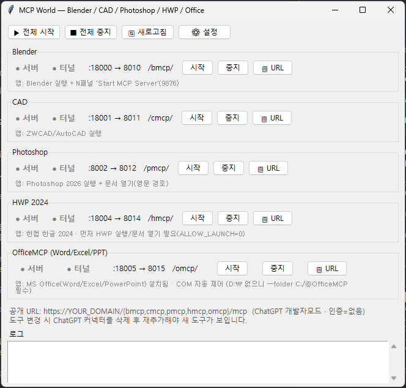

# MCP World — Blender / CAD / Photoshop / HWP / Office 통합 컨트롤러

**한국어** | [English](README_en.md)


> ### 🌐 Claude뿐 아니라 **ChatGPT 웹브라우저에서도** 로컬 MCP를 씁니다
> MCP는 보통 Claude Desktop 같은 데스크톱 클라이언트에서만 연결된다고 알려져 있지만,
> **MCP World**는 로컬 MCP 서버를 **SSH 역터널 → 공개 URL**로 노출해 **ChatGPT 개발자 모드
> 커넥터**에 그대로 연결합니다. 즉 별도 데스크톱 앱 없이 **ChatGPT 웹에서** Blender·CAD·
> Photoshop·한글·Office를 자연어로 제어할 수 있습니다.



ChatGPT 웹에 연결되는 로컬 MCP(서버 + VPS 역터널)들을 한 창에서 켜고 끄는 GUI.

> ⚠️ **Windows 11 전용**입니다. macOS·Linux에서는 동작하지 않습니다.
> 제어 대상 앱(한글·MS Office·Photoshop·CAD)이 모두 **Windows COM 자동화**에 의존하고, `config.json`의 실행 경로도 `C:/...\Scripts\*.exe` 형식으로 하드코딩되어 있기 때문입니다.

## 설정 (처음 한 번)

1. `config.example.json`을 `config.json`으로 복사합니다.
2. 본인 환경에 맞게 값을 채웁니다:
   - `vps_ssh` — VPS SSH 대상 (예: `root@YOUR_VPS_IP`)
   - `public_base` — 공개 도메인 (예: `https://YOUR_DOMAIN`)
   - 각 MCP의 `cwd`·`server`·`install` 경로/저장소 URL
3. `config.json`은 `.gitignore`에 포함되어 커밋되지 않습니다(개인 설정 보호).

> VPS nginx 라우팅은 아래 **"VPS에 새 MCP 추가하기"** 의 템플릿을 참고하세요.

> ℹ️ 5개 MCP 모두 **공개 저장소(github.com/JS190-prog/*)** 또는 PyPI(`uvx`)에서
> 자동 설치됩니다. `config.example.json`에 실제 저장소가 연결돼 있어, **VPS·도메인만
> 본인 값으로 채우면** 시작 시 자동으로 clone·설치됩니다. 커스터마이즈하려면 각
> repo를 fork한 뒤 `install` URL을 바꾸세요.

## 구성
- `mcpworld.pyw` — GUI 본체 (tkinter + pystray 트레이)
- `config.json` — MCP 정의 (포트·경로·실행 명령·환경변수)
- `.venv\` — 전용 가상환경 (pystray, pillow)
- `logs\` — 각 MCP의 서버/터널 로그 (`<id>-server.log`, `<id>-tunnel.log`)

## 관리 대상
| MCP | 로컬 포트 | VPS 포트 | 공개 URL |
|---|---|---|---|
| Blender | 18000 | 8010 | https://YOUR_DOMAIN/bmcp/mcp |
| CAD | 18001 | 8011 | https://YOUR_DOMAIN/cmcp/mcp |
| Photoshop | 8002 | 8012 | https://YOUR_DOMAIN/pmcp/mcp |
| HWP 2024 | 18004 | 8014 | https://YOUR_DOMAIN/hmcp/mcp |
| Office | 18005 | 8015 | https://YOUR_DOMAIN/omcp/mcp |

각 행: **서버**(로컬 포트) + **터널**(SSH 역터널) 상태등 → 둘 다 초록이면 ChatGPT에서 사용 가능.

## 실행
- 바탕화면 **`MCP World`** 바로가기 더블클릭, 또는
- `\.venv\Scripts\pythonw.exe mcpworld.pyw`

## 사용
1. **▶ 전체 시작** — 모든 서버 기동 → 포트 대기 → 역터널 연결
2. 각 MCP의 상태등(서버·터널)이 모두 초록이 되면 준비 완료
3. 각 대상 앱(Blender / ZWCAD / Photoshop / 한글 / Office)을 실행하고 작업 문서를 열어둔다
   - HWP·Office는 `config.json`의 `env` 설정으로 미실행 시 자동 실행되도록 되어 있다
4. ChatGPT 개발자 모드 커넥터에 위 URL을 추가 (인증=없음)
5. 끝나면 **■ 전체 중지**

> **⚙ 설정** 버튼으로 모든 MCP의 포트·경로·환경변수·서버 명령을 GUI에서 편집할 수 있다(저장 후 재시작 시 적용).

---

## CAD 파일 업로드 주의사항

ChatGPT 웹에 업로드된 파일의 `/mnt/data/...` 경로는 OpenAI 샌드박스 내부 경로다. 로컬 Windows PC에서 실행되는 CAD MCP 서버는 이 경로를 직접 읽을 수 없다.

따라서 다음 방식은 자동 처리로 간주하지 않는다:

```json
{ "file_path": "/mnt/data/plan.dwg" }
```

과거에는 `/mnt/data/plan.dwg`의 파일명만 보고 `C:\cad-mcp\workspace`, `C:\cad-mcp\inbox`, `Downloads`에서 같은 이름의 파일을 찾아 열려고 했지만, 이 방식은 기존 캐시 파일을 잘못 여는 사고를 만들 수 있어 제거했다.

CAD MCP에서 허용하는 안전한 경로:

- 사용자가 CAD에 원본 도면을 직접 열어둔 뒤 `get_active_document_info`, `list_text_entities`, `update_entity`, `save_as_generated` 등 현재 열린 도면 도구를 사용한다.
- 실제 파일 bytes가 `upload_and_open_drawing(file_base64=...)` 또는 `upload_drawing_chunk`로 전달된 경우만 업로드 파일로 처리한다.
- 명시적인 로컬 Windows 경로 또는 `C:\cad-mcp\inbox`에 직접 둔 파일만 연다.

`file_id`도 로컬 서버가 자동으로 bytes를 가져올 수 없다. 별도 bridge가 실제 파일 bytes를 보내지 않는 한 거부된다.

---

## VPS에 새 MCP 추가하기 (How-To)

새 도구(MCP)를 ChatGPT에서 쓰려면 **① 로컬 등록 → ② VPS 공개(nginx) → ③ ChatGPT 연결** 3단계만 하면 된다.

**연결 흐름**
```
ChatGPT  ──HTTPS──▶  https://YOUR_DOMAIN/<경로>/mcp
                          │  (VPS nginx 역방향 프록시)
                          ▼
                     VPS 127.0.0.1:<vps_port>
                          │  (SSH 역터널 — GUI가 자동 생성)
                          ▼
                     내 PC 127.0.0.1:<local_port>
                          │  (로컬 MCP 서버)
                          ▼
                     대상 앱 (Blender / 한글 / Office ...)
```

### 1단계 — 로컬 등록 (`config.json`)

GUI의 **⚙ 설정** 버튼으로 추가하거나, `config.json`의 `mcps` 배열에 항목을 직접 추가한다:

```json
{
  "id": "myapp",
  "name": "My App",
  "local_port": 18006,
  "vps_port": 8016,
  "path": "/amcp/",
  "cwd": "C:/path/to/server",
  "server": ["C:/path/to/python.exe", "server.py", "--port", "18006"],
  "env": { "MY_FLAG": "1" }
}
```

| 필드 | 의미 |
|---|---|
| `id` | 고유 식별자(로그 파일명에도 사용) |
| `local_port` | 비어 있는 로컬 포트 |
| `vps_port` | 비어 있는 VPS 포트(8010~ 대역에서 겹치지 않게) |
| `path` | 공개 경로(예: `/amcp/`) → URL은 `.../amcp/mcp` |
| `cwd` / `server` | 서버 실행 폴더 / 실행 명령(배열) |
| `env` | (선택) 서버에 전달할 환경변수 (예: HWP 자동 실행 `HWP_MCP_ALLOW_LAUNCH=1`) |

> **stdio 방식 MCP**는 `mcp-proxy`로 감싸 HTTP로 노출한다(CAD·HWP·Office가 이 방식). 예:
> ```
> "server": ["C:/cad-mcp/.proxy-venv/Scripts/mcp-proxy.exe",
>            "--host", "127.0.0.1", "--port", "18006",
>            "--transport", "streamablehttp", "--pass-environment", "--",
>            "C:/path/python.exe", "server.py"]
> ```

GUI를 재시작 → 새 행의 **시작** → 서버 상태등이 초록이면 로컬 등록 완료.

### 2단계 — VPS 공개 (nginx 라우팅)

SSH로 VPS에 접속해 nginx 설정 파일에 `location` 블록을 추가한다.

```bash
ssh root@YOUR_VPS_IP
nano /etc/nginx/sites-available/automaton-dashboard-http.conf
```

아래 블록을 추가한다 — **`/amcp/`(경로)와 `8016`(vps_port)만** 내 값으로 바꾸면 된다:

```nginx
# === amcp (ChatGPT connector) BEGIN ===
location ^~ /amcp/ {
    rewrite ^/amcp/(.*)$ /$1 break;
    proxy_pass http://127.0.0.1:8016;   # ← vps_port
    proxy_http_version 1.1;
    proxy_set_header Host $host;
    proxy_set_header X-Real-IP $remote_addr;
    proxy_set_header X-Forwarded-For $proxy_add_x_forwarded_for;
    proxy_set_header X-Forwarded-Proto $scheme;
    proxy_set_header Connection "";
    proxy_buffering off;
    proxy_cache off;
    proxy_read_timeout 24h;
    proxy_send_timeout 24h;
    client_max_body_size 150M;
}
# === amcp END ===
```

저장 후 **반드시 검증하고 적용**한다 (문법 오류면 절대 reload하지 말 것 — 다른 서비스까지 멈춤):

```bash
nginx -t && systemctl reload nginx
```

> **되돌리기:** 추가한 `# === amcp BEGIN/END ===` 블록을 통째로 지우고 다시 `nginx -t && systemctl reload nginx`.
> 기존 블록들도 같은 `# === <name> BEGIN/END ===` 주석으로 구분되어 있어 찾기 쉽다.

### 3단계 — ChatGPT 연결

ChatGPT 개발자 모드 커넥터에 공개 URL을 추가한다 (인증 = 없음):

```
https://YOUR_DOMAIN/amcp/mcp
```

- GUI에서 해당 행의 **📋 URL** 버튼으로 주소를 복사할 수 있다.
- **도구를 바꾸면** 커넥터를 삭제 후 다시 추가해야 새 도구 목록이 보인다.

---

## 주의
- **로컬 PC가 켜져 있고** 서버+터널이 살아 있어야 ChatGPT가 동작한다.
- 창 X 버튼 → 트레이로 최소화(계속 동작). 트레이 아이콘 → 종료.
- "종료(서버는 유지)"는 GUI만 닫고 서버/터널은 백그라운드 유지 → 완전히 끄려면 먼저 **전체 중지**.
- 무인증 공개 상태이므로 쓸 때만 켜는 것을 권장.
