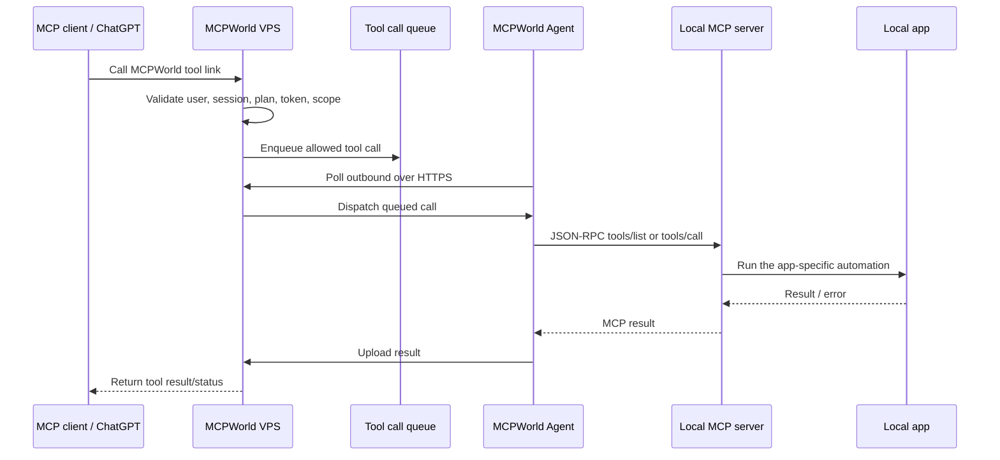

# MCPWorld single-agent relay architecture

MCPWorld lets a user install only the MCPWorld Agent, then connect MCP tool links from MCPWorld without installing one MCP server per app inside ChatGPT. Public links can be issued through a Cloudflare Worker proxy such as `https://mcpworld-proxy.YOUR_SUBDOMAIN.workers.dev/mcpworld/{key}/mcp` so the direct VPS route is not exposed.

The target local app and its local MCP server still need to exist on the user's PC. The difference is that ChatGPT connects to MCPWorld, and MCPWorld routes approved calls through the installed agent to the already-configured local MCP programs.



## Current implementation

### VPS/API

- `GET /api/tools/catalog` returns the VPS-owned catalog.
- `POST /mcp?key=...` is the short MCP endpoint used by the Worker proxy.
- `MCPWORLD_PROXY_PUBLIC_BASE` makes issued dashboard links use the Worker URL shape instead of direct VPS URLs.
- `POST /api/sessions/issue` creates a connector session for one program slug such as `powerpoint`, `cad`, or `hwp`.
- `POST /api/tool-calls/enqueue` queues only tools allowed for that session.
- `GET /api/tool-calls/{call_id}` reads call status and result.
- `POST /api/agent/register` registers or refreshes the installed agent.
- `POST /api/agent/poll` dispatches one queued call to the user's agent.
- `POST /api/agent/result` stores the agent result.

### MCPWorld Agent

The agent reads a local MCP config from one of these locations:

1. `--mcp-config C:\path\to\config.json`
2. `MCPWORLD_LOCAL_MCP_CONFIG`
3. `%USERPROFILE%\.mcpworld\config.json`
4. `C:\scratch\mcpworld\config.json`

A public-safe template is available at `agent/mcpworld-mcp-config.example.json`.

The agent now supports two layers:

- App availability checks: `word.status`, `powerpoint.status`, `excel.status`, `cad.status`, `hwp.status`, `photoshop.status`, `blender.status`.
- Local MCP relay calls: `word.mcp.call`, `powerpoint.mcp.call`, `excel.mcp.call`, `cad.mcp.call`, `hwp.mcp.call`, `photoshop.mcp.call`, `blender.mcp.call`.

`word`, `powerpoint`, and `excel` map to the local `office` MCP entry. The other slugs map to matching local MCP ids.

A relay call uses this argument shape:

```json
{
  "tool": "local_mcp_tool_name",
  "arguments": {
    "key": "value"
  }
}
```

The agent forwards it to the local MCP endpoint as JSON-RPC `tools/call`.

## Product wording

Recommended wording:

> Install MCPWorld Agent once. MCPWorld routes approved tool calls through the VPS to your agent, then your agent calls your configured local MCP programs.

Avoid this wording:

> No local program or local MCP server is needed.

That would be inaccurate for tools that need Word, Excel, CAD, HWP, Photoshop, Blender, or their local MCP servers installed and running.
