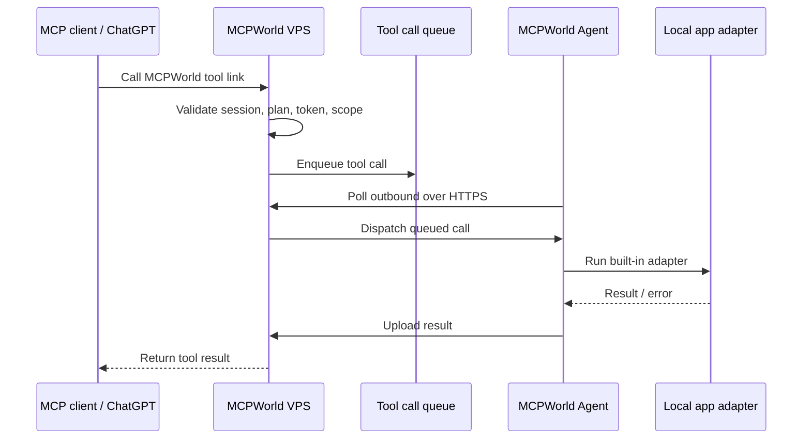

# MCPWorld single-agent relay architecture

## Goal

MCPWorld should let a user install only the MCPWorld Agent, then connect MCP tool links from MCPWorld without installing one MCP server per app.

This removes per-tool MCP installation and configuration. It does not remove the need for the target local app itself when a tool controls a local program such as Word, Excel, CAD, HWP, Photoshop, or Blender.

## Runtime flow

## Components

### VPS control plane

- Publishes MCPWorld links and session routes.
- Owns authentication, billing state, user status, admin actions, and audit logs.
- Stores the tool catalog and queues each tool call.
- Exposes HTTPS endpoints for the installed MCPWorld Agent.

### MCPWorld Agent

- Installed once on the user's PC.
- Registers the device with the VPS.
- Polls the VPS using outbound HTTPS, so the user's PC does not need an inbound public port.
- Contains built-in adapters for supported local apps.
- Executes only tools allowed by the VPS session and returns structured results.

### Built-in adapters

The current implementation includes status adapters for:

- `system.ping`
- `word.status`
- `powerpoint.status`
- `excel.status`
- `cad.status`
- `hwp.status`
- `photoshop.status`
- `blender.status`

These are the first safe adapter layer. Deeper actions such as opening files, converting documents, exporting drawings, or controlling app UI should be added per adapter with explicit allowlists, file path restrictions, and audit logging.

## API surface

- `GET /api/tools/catalog` returns the VPS-owned tool catalog.
- `POST /api/sessions/issue` creates a session and MCPWorld relay link.
- `POST /api/tool-calls/enqueue` queues a tool call for a valid session.
- `GET /api/tool-calls/{call_id}` reads call status and result.
- `POST /api/agent/register` registers or refreshes the installed agent.
- `POST /api/agent/poll` lets the agent receive one queued call.
- `POST /api/agent/result` stores the agent result.

## Product wording

Recommended wording:

> Install MCPWorld Agent once. MCPWorld routes approved tool calls through the VPS to your agent, so you do not need to install separate MCP servers for every supported app.

Avoid promising:

> No local software is required.

That would be inaccurate for tools that need a local application installed.
